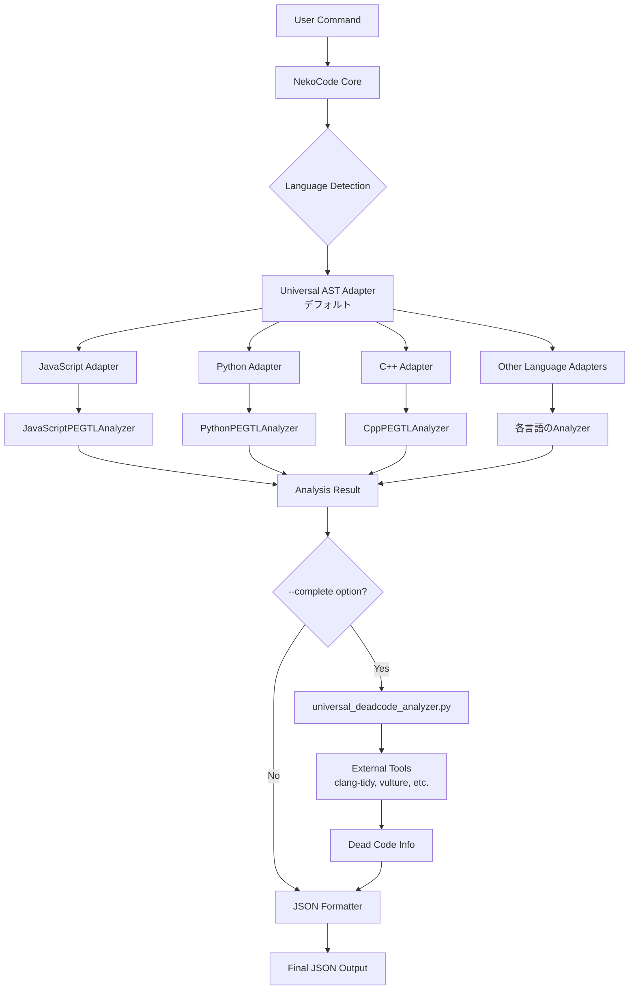

# 🏗️ NekoCode Architecture Guide

## 📊 システム全体の処理フロー



## 🎯 コアコンポーネント

### 1. **Universal AST Adapters** (`src/adapters/`)
**役割**: 言語統一インターフェース（デフォルトで使用）

```cpp
class LanguageUniversalAdapter {
    std::unique_ptr<LanguagePEGTLAnalyzer> legacy_analyzer;
    
    AnalysisResult analyze(const std::string& content, const std::string& filename) {
        // Step 1: 成熟したPEGTL解析を使用
        AnalysisResult result = legacy_analyzer->analyze(content, filename);
        
        // Step 2: 統一AST構築
        build_unified_ast_from_legacy_result(result, content);
        
        return result;
    }
};
```

**実装済みアダプター**:
- `javascript_universal_adapter.hpp` - JavaScript用
- `python_universal_adapter.hpp` - Python用
- `cpp_universal_adapter.hpp` - C++用
- `csharp_universal_adapter.hpp` - C#用
- `go_universal_adapter.hpp` - Go用
- `rust_universal_adapter.hpp` - Rust用

### 2. **PEGTL Analyzers** (`src/analyzers/`, `include/nekocode/analyzers/`)
**役割**: 各言語の高精度解析エンジン

- **JavaScript/TypeScript**:
  - `javascript_pegtl_analyzer.hpp` (2,260行 - 最大)
  - `typescript_pegtl_analyzer.hpp` (1,854行)
  - PEGTL文法による完全パース

- **Python**:
  - `python_pegtl_analyzer.hpp`
  - インデントベースのフォールバック機能付き
  - クラス内メソッド完全検出

- **C++**:
  - `cpp_pegtl_analyzer.hpp`
  - テンプレート、namespace対応
  - ブレースマッチングによるend_line検出

- **その他**:
  - `csharp_pegtl_analyzer.hpp` - C#用
  - `go_analyzer.cpp` - Go用
  - `rust_analyzer.cpp` - Rust用

### 3. **共通データ構造** (`include/nekocode/types.hpp`)

```cpp
struct AnalysisResult {
    FileInfo file_info;                              // ファイル情報
    std::vector<ClassInfo> classes;                  // クラス情報
    std::vector<FunctionInfo> functions;             // 関数情報
    std::vector<ImportInfo> imports;                 // インポート
    std::vector<ExportInfo> exports;                 // エクスポート
    ComplexityInfo complexity;                       // 複雑度
    std::unordered_map<std::string, std::string> metadata;  // 拡張情報
    Statistics stats;                                // 統計
};
```

### 4. **JSON Formatter** (`src/formatters/formatters.cpp`)
**役割**: 解析結果をJSON形式で出力

```cpp
class AIReportFormatter {
    std::string format_single_file(const AnalysisResult& result) {
        nlohmann::json json_result;
        
        json_result["file_info"] = {...};
        json_result["functions"] = [...];
        json_result["classes"] = [...];
        json_result["statistics"] = {...};
        
        // TODO: metadataフィールドの出力（dead_code情報含む）
        
        return json_result.dump(2);
    }
};
```

## 🔄 処理フローの詳細

### **通常解析フロー**
1. ユーザーがコマンド実行
2. `AnalyzerFactory::create_analyzer()` で言語判定
3. **Universal AST Adapter** を生成（デフォルト）
4. Adapter内で **PEGTL Analyzer** を呼び出し
5. 高精度な解析結果を取得
6. 統一AST構築
7. JSON形式で出力

### **デッドコード検出フロー** (`--complete`)
1. 通常解析完了後
2. `perform_complete_analysis()` 呼び出し
3. `universal_deadcode_analyzer.py` 実行
4. 外部ツール呼び出し:
   - C++: `clang-tidy`
   - Python: `vulture`
   - Go: `staticcheck`
   - Rust: `cargo clippy`
5. 結果をmetadataに保存
6. JSON出力に含める

## 📁 ディレクトリ構造

```
nekocode-cpp-github/
├── src/
│   ├── adapters/          # Universal AST Adapters
│   ├── analyzers/         # 言語別PEGTL Analyzers
│   ├── core/              # コア機能
│   ├── formatters/        # 出力フォーマッター
│   ├── tools/             # 外部ツール連携
│   └── universal/         # 統一アーキテクチャ基盤
├── include/nekocode/
│   ├── types.hpp          # 共通データ構造
│   └── analyzers/         # Analyzerヘッダー
└── docs/
    ├── ARCHITECTURE.md    # このファイル
    └── ...
```

## ⚙️ 重要な設定

### **ビルドオプション / 環境**
- `NEKOCODE_ENABLE_UNIVERSAL_AST` (CMake option) - Universal AST/Adapter群を有効化。
  - 既定: OFF（必要に応じて有効化）
- ~~`NEKOCODE_USE_UNIVERSAL_AST`~~ - 廃止済み（環境変数での切替はサポートしません）

### **コマンドラインオプション**
- `--complete` - デッドコード検出を有効化（外部ツール必須）
- `--stats-only` - 高速統計のみ
- `--io-threads N` - 並列読み込み数
- `--output json` - JSON形式出力

### **デッドコード検出の補足**
- `universal_deadcode_analyzer.py` は設計上の外部スクリプトです（本リポジトリには同梱されません）。
  - 必要に応じて任意の場所へ配置し、呼び出しロジック側でパスを解決してください。
  - 外部ツール（clang-tidy / vulture / staticcheck / cargo clippy 等）の導入が別途必要です。

## 🔧 拡張ポイント

### **新言語追加手順**
1. `src/adapters/` に `<language>_universal_adapter.hpp` 作成
2. 既存のPEGTL Analyzerを活用または新規作成
3. `AnalyzerFactory` に言語判定追加
4. テスト追加

### **デッドコード検出ツール追加**
1. `universal_deadcode_analyzer.py` の `_analyze_<language>_deadcode()` 実装
2. 外部ツールのインストール手順をドキュメント化

## 📝 注意事項

- **Universal AST** と **universal_deadcode_analyzer** は名前が似ているが別物
- Universal ASTは通常解析、deadcode_analyzerはデッドコード検出専用
- 外部ツールなしでも通常解析は完全動作
- JavaScript/TypeScriptアナライザーの肥大化問題は今後のリファクタリング対象

---
**最終更新**: 2025-08-07  
**重要**: このドキュメントがNekoCodeアーキテクチャの正式な参照資料です
